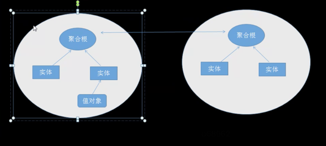

GIN脚手架进化

## 充血模型

领域模型（DM）
UserObject
id int
name string
UserAdd()
UserDel()
UserQuery()
UserUpdate()

->

业务层
譬如UserLogin 调用了 UserQuery 和 UserUpdate

包括持久层的逻辑都定义在领域模型中，业务层主要调用模型层完成业务的组合调用和事物的封装


## 失血模型

领域模型（DM）

UserObject
id int
name string

业务对象（BO）

1. queryUserList
2. createUserList
3. findByUserID


## 常见的四层

* Infrastructure (基础实施层)
* Domain （领域层）
* Application （应用层）
* Interfaces （表示层，也叫用户界面层或是接口层）

```txt
|---------------------> interfaces
|
Infrastructure--------> Application
|
|---------------------> Domain
```


### Infrastructure (基础实施层)

> 与所有层进行交互

譬如：

1. 我们自己写的业务工具类
2. 配置信息
3. 第三方库的集成和初始化
4. 数据持久化机制等；

### Domain (领域层)

> 核心层，业务逻辑会在该层实现

譬如包含了

1. 实体
2. 值对象
3. 聚合
4. 工厂方法
5. Repositories仓储实例

#### 具体技法

领域层： 用户实体编写和值对象

1. 建表

```txt
user_id user_name user_pwd   user_phone   user_city  user_qq   user_createTime
1       alex       123456    18802030405   武汉       1260232   2023.03.19
```

2. 实体

以上这张表是用户的信息，我们认为 用户名 是唯一的标识；

定义用户实体，如上面的表结构，有唯一的标识（必须），也包含各种属性，也可以包含如数据验证
操作前置函数，构造函数实例化等等

如：前置函数

```go
func (this *UserModel) BeforeSave() {
	// md5
	this.UserPwd = fmt.Sprintf("%x", md5.Sum([]byte(this.UserPwd)))
}
```

构造函数 ， apply你懂得；

3. 用户值对象

```go
type UserModel struct {
	UserId   int    `gorm:"column:user_id;primary_key;auto_increment" json:"user_id"`
	UserName string `gorm:"column:user_name" json:"user_name"`
	UserPwd  string `gorm:"column:user_pwd" json:"user_pwd"`
	Extra *UserExtra // 值对象
}

// 额外信息

type UserExtra struct {
	UserPhone string `gorm:"column:user_phone" json:"user_phone"`
	UserQQ    string `gorm:"column:user_qq" json:"user_qq"`
	UserCity  string `gorm:"column:user_city" json:"user_city"`
}
```
Extra 属性关联了 UserModel 和 UserExtra，UserModel是通过Extra属性来指向UserExtra对象 
它就是值对象；

有2个重要原则

1. 实体只能通过ID（唯一标识）来判断两者是否相同
2. 而值对象，只需根据"值" 就能判断两者是否相等；

```go
func (this *UserExtra) Equals(other *UserExtra) bool {
	return this.UserPhone == other.UserPhone && this.UserQQ == other.UserQQ && this.UserCity == other.UserCity
}
```

不可变
修改值对象，必须传入新对象；

```go
user:= NewUserModel(
	    WithUserName("shenyi"),
		WithUserName(
		    NewUserExtra(
			    WithUserCity("北京"),
				WithUserQQ("qq")
			))
	)
```

比如在更新extra属性时，传入的是一整个 UserExtra对象。不存在更改该值对象的某个属性；

3. 领域层：实体接口、聚合的概念

Java中实体专门有实体的抽象类和专门的接口；在Go中没有继承，只有嵌套。在这一块实现起来
不如Java

规范实体的整体接口和抽象类；

**实体接口**

```go
// 接口
type IModel interface {
	ToString() string
}

// 模拟抽象类

type Model struct {
	Id   int
	Name string // 实体名称
}

func (this *Model) SetName(name string) {
	this.Name = name
}

func (this *Model) SetId(id int) {
	this.Id = id
}

// 模型里面所有的模型都有一个名称和一个主键ID；实体和实体之间是否相等的
// 判断。这个时候通过id来判断；

func (this *Model) ToString() string {
	return fmt.Sprintf("Model is %s, id is %d", this.Name, this.Id)
}

func main(){
	user:=models.NewUserModel(
	    models.WithUserID(101),
		models.WithUserName("alex")
	)
	fmt.Println(user.ToString())
}
```

**聚合的概念**

> 聚合包括一组领域对象（包括实体和值对象），完整描述一个领域业务，其中必然有个根实体，这个叫做聚合根

譬如我们例子中

用户登录这个聚合，用户实体就是聚合根（包含了各个值对象）

假设我们还有用户日志这个功能，其中用户日志包含了，用户登录日志，用户购买日志，用户充值日志；
这3个聚合，用户实体都是他们的聚合根；


譬如有的功能是做的好友功能，可以加入我的好友，感兴趣的用户；
也可以做个订单功能；譬如订单里面有下单用户，当前用户的下单情况；
或者用户登录有登录日志等等；

这些功能其实都有一个根对象的概念，根对象就是  **用户**; 所有功能都聚合到一个对象上面；这个对象就是用户；

```text
订单 ---->
        |
库存 ----------->  商品
        |
物流 ---->
```

主订单，库存，物流 聚合的根就是商品；

4. 领域层：初步划分聚合（用户为例）

```go
// 实体
type UserModel struct {
	*Model
	UserId   int                  `gorm:"column:user_id;primary_key;auto_increment" json:"user_id"`
	UserName string               `gorm:"column:user_name" json:"user_name"`
	UserPwd  string               `gorm:"column:user_pwd" json:"user_pwd"`
	Extra    *valueobjs.UserExtra // 值对象
}
```
实体：操作用户的充值，用户的登录以及用户各种各有的操作都可能用到用户实体；
从这个角度看，操作业务很少会单表操作；很有可能会操作多个实体；这个聚合就是一堆（一组）
领域对象组成的领域的描述；

文字说明：
- 每个聚合都有一个根和一个边界
- 边界内定义了聚合的内部有什么
- 根则是聚合所包含的一个特定的实体
- 外部对象可以引用根，但不能引用聚合内部的其他对象
- 聚合内的对象之间可以相互引用 （但是使用的是聚合根作为交互对象）



划分聚合的时候，需要划分出边界，边界中包含了哪些实体；这些实体中包含了哪些值对象。
然后必须有一个聚合根。


比如说这两个聚合，会员聚合 和 订单聚合；这两个聚合进行沟通的是 根对根进行的沟通；
订单不会取会员 里面的某个日志；它只会取根（会员信息）

这里将用户对象拔高一下；改为Member

在domain文件夹下，aggregates就是聚合对象；
在aggregates文件夹下，每一个文件夹就是一个聚合对象；这里以Member为例；

Member: 会员；会员和用户是什么区别？

User是我们的底层对象，Member是我们的业务对象；也可以是领域业务；
这两者是不同的，Member是基于User的；


```go
type Member struct {
	User        *models.UserModel // 根
	Log         *models.UserLogsModel
}
```

Member是一个聚合对象，它包含了User和Log；
它就是操作会员相关的最小单元；而不是直接去操作User entity；

用户登录后台，可以看到自己的登录信息和操作日志；操作的对象就是Member这个聚合；
而不是某一个实体；
当然Member聚合的 入口是User这个根；必须有这个User，后面的内容才会有；否则不会有；

因此 在当前业务下，我们姑且认为， 会员是由 用户User 和用户日志Log组成的；

注意： 聚合仅仅是定义聚合， 这个聚合方法不写在聚合里面哦；


5. 领域层：仓储层，基础设施层

什么是仓储层？

> 为每一个聚合根对象（实体）创建一个仓储接口，并且不和底层数据库交互。
作用： 更好的把我们的精力集中在领域逻辑上，也就是写业务的时候，
不用去关心底层对数据库的操作； 彻底解耦开来；

repos

```go
// IUserRepo.go
type IUserRepo interface {
    FindByName(name string) *models.UserModel
    SaveUser(*models.UserModel) error
    UpdateUser(*models.UserModel) error
	DeleteUser(*models.UserModel) error
}

type IUserLogRepo interface {
    FindByName(name string) *models.UserLogsModel
    SaveLog(model *models.UserLogsModel) error
}
```

它的具体的实现放在infrastructure层（基础设施层）

接下来在 `infrastructure/dao`中进行repo接口的实现；

6. 聚合方法示例（用户为例）

```go
// 会员聚合，---- 会员： 用户+日志组成的；
// 数据操作最小单元，聚合


type Member struct {
    User *models.UserModel // 根
    Log  *models.UserLogsModel
}

// demo： 创建会员
func (this *Member) Create() {

}
```

我们将member抽象出来，变成一个聚合；假设我们的业务操作，无论是登录用户，还是注册用户；都会涉及到日志；所以聚合在一起。变成member

7. 领域层：领域服务层的基本使用

> 实现特定于某个领域的任务，当某个操作"不适合"放在聚合（实体）或值对象时，那么可以使用领域服务

操作内容：

(1). 操作多个聚合根
(2). 也可以调用仓储层
(3). 代码可以相对灵活一些
(4). 命名一般要能直接描述出该代码业务的功能

* 譬如我们把用户登录的过程写在服务里

```text
// 登录过程一般是

1. 根据用户和密码进行判断
    1. 先判断用户是否存在，如果存在取出用户
    2. 根据传过来的密码和库中的密码采用"相同策略" 加密等方法判断
2. 如果登录失败,记录系统日志
3. 如果登录成功，记录登录日志
4. 用户登录安全判断，譬如ip是不是常用地等
5. 根据用户登录次数，给积分奖励
```

在domain层下创建services文件夹，然后创建UserService.go文件

```go
package services


type UserLoginService struct {
	userRepo repos.IUserRepo
}

func (this *UserLoginService) UserLogin(userName string, userPwd string) (string, error) {
	user := this.userRepo.FindByName(userName)
	if user.UserId > 0 { // 有这个用户
		// md5
		if user.UserPwd == utils.MD5(userPwd) {
			// 用户登录安全判断，比如IP校验
			// 根据用户登录次数，给予奖励。也都写在这里的；
			// todo 思考题 当用户登录成功之后，登录日志的动作要怎么做，要写在哪里？ 答案 调用聚合就成；
			return "1000200", nil
		} else {
			return "1000400", fmt.Errorf("密码不正确")
		}
	} else {
		return "1000404", fmt.Errorf("用户不存在")
	}
}

```


### Application（应用层）

> 连接domain 和 interfaces层

对于interface层，提供各种业务功能方法；
对于domain层，调用domain层完成业务逻辑；

* 基本顺序

展现层（api层）调用应用层，应用层调用领域层，领域层或调用基础实施层（数据持久化都是放在基础实施层的）；

#### DTO（Data Transfer Object）

> 中文含义是数据传输对象。。。 主要针对于展示层和应用层传输数据

那到底传输什么？

最直观的理解就是API的输出格式

1. 处理返回问题

```json
{
  "message": "xxx",
  "result": {}, // 通过json处理之后，返回一个对象，比如用户；或者一个数组
  "code": 1000200
}
```

以上格式是由应用层来处理的；


```go
// /srcddd/application/dto/MessageResult.go
type MessageResult struct {
    Result  interface{} `jsn:"result"`
    Message string      `json:"message"`
    Code    int         `json:"code"`
}
```

2. 用户信息的展示

> 有的时候在页面上展示的是一个简易的用户信息，比如只需要展示 name和city，不需要展示整个UserModel的全属性字段

比如以下；

```go
type SimpleUserInfo struct {
	Id int `json:"id"`
	Name string `json:"name"`
	City string `json:"city"`
}
```

那传统的技法，不使用dto，不使用DDD，可能就是针对model （UserModel）进行裁剪；
那这种做法在DDD的技法之下是，是不可取的。一般是使用


3. 复杂信息，需要显示用户详细信息，和最近操作网站的日志（个人中心首页常用）


```go
type UserLog struct {
	Id   int       `json:"id"`
	Log  string    `json:"log"`
	Date time.Time `json:"date"`
}

type UserInfo struct {
	Id    int        `json:"id"`
	Name  string     `json:"name"`
	City  string     `json:"city"`
	Phone string     `json:"phone"`
	Logs  []*UserLog `json:"logs"`
}
```

**思考：如何赋值**


##### DTO和实体的映射


**Assembler**

主要完成的是

完成领域对象和响应的DTO对象之间的类型转换、数据填充、多个领域对象的组装成一个DTO

```go
// 把用户实体映射为简单用户DTO
func (this *UserRSP) M2D_SimpleUserInfo(user *models.UserModel) *dto.SimpleUserInfo {
	simpleUser := &dto.SimpleUserInfo{}
	simpleUser.Id = user.UserId
	simpleUser.Name = user.UserName
	simpleUser.City = user.Extra.UserCity
	return simpleUser
}
```

#### 应用层Service层

主要职责
1 向上：给interface层调用，提供各种功能
2 向下：调用领域
很薄的一层，没有业务逻辑，不应该存在if/else这种判断


* 场景案例

根据ID获取用户详细，假设后面的uri 是这样的 `/users/123`
(注意假设，这个业务特别简单，只要取用户名和城市，没有任何业务逻辑，不需要记录日志，不需要做判断)

一共分几步：

1 创建请求DTO
2 DTO2Model 的操作
3 调用并返回


```go
type UserService struct {
	assUserReq *assembler.UserReq
	assUserRsp *assembler.UserRSP
	userRepo   repos.IUserRepo
}

func (this *UserService) GetSimpleUserInfo(req *dto.SimpleUserReq) *dto.SimpleUserInfo {
	userModel := this.assUserReq.D2M_UserModel(req)
	this.userRepo.FindById(userModel)
	//实际返回的是 messageResult，这里演示方便，先只返回result部分
	return this.assUserRsp.M2D_SimpleUserInfo(userModel)
}
```

### Interfaces （表示层，也叫用户界面层或接口层）

在前面的代码中，我们发现 domain （领域层）跟 框架gin web框架是没有关系的；纯粹是为了解决业务问题；
一旦到了表示层，就需要跟框架打交道了；

一言以避之：就是处理http请求和响应的层
普通 gin里就是 gin.HandlerFunc

在我们手撸的gin脚手架里就是我们自己写的控制器，这一层里面类似

1 中间件
2 过滤器
3 和框架相关的其他封装都可以放到这一层

